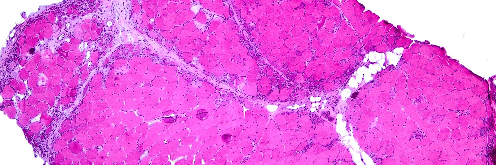

::: {.content-visible when-profile="en"}
```{=html}
<div style="display:flex;gap:2rem;align-items:center;flex-wrap:wrap;margin:1.5rem 0 0.5rem;">
  
  <div>
    <h1 class="title" style="margin:0;">José César Milisenda</h1>
    <div class="hero-role">MD, PhD &middot; Internal Medicine &amp; Neuromuscular Disease</div>
  </div>
</div>
```

Head of the **Unit of Neuromuscular, Mitochondrial and Autonomic Nervous System Diseases (UF-MNMA)** at Hospital Clínic de Barcelona, and Associate Professor at the **Universitat de Barcelona**. My work centres on the idiopathic inflammatory myopathies — dermatomyositis, immune-mediated necrotizing myopathy, inclusion body myositis and the antisynthetase syndrome — integrating clinical phenotyping, muscle histopathology and molecular biology.

I trained in Medicine at the National University of Córdoba, completed my Internal Medicine residency and PhD (*cum laude*, 2019) at Hospital Clínic / Universitat de Barcelona, and was a **postdoctoral fellow at the NIH / NIAMS** (Bethesda). I coordinate our unit's private biological sample collection.

**Research lines**

[Inflammatory myopathies]{.research-tag} [Muscle histopathology]{.research-tag} [Muscle transcriptomics / RNA-seq]{.research-tag} [Myositis-specific autoantibodies]{.research-tag} [Muscle biobanking]{.research-tag}
:::

::: {.content-visible when-profile="ca"}
```{=html}
<div style="display:flex;gap:2rem;align-items:center;flex-wrap:wrap;margin:1.5rem 0 0.5rem;">
  
  <div>
    <h1 class="title" style="margin:0;">José César Milisenda</h1>
    <div class="hero-role">MD, PhD &middot; Medicina Interna i Malaltia Neuromuscular</div>
  </div>
</div>
```

::: {.callout-note appearance="simple"}
Esborrany de traducció — pendent de revisió.
:::

Cap de la **Unitat de Malalties Neuromusculars, Mitocondrials i del Sistema Nerviós Autònom (UF-MNMA)** de l'Hospital Clínic de Barcelona i professor associat de la **Universitat de Barcelona**. La meva recerca se centra en les miopaties inflamatòries idiopàtiques — dermatomiositi, miopatia necrotitzant immunomediada, miositi per cossos d'inclusió i síndrome antisintetasa —, integrant la caracterització clínica, la histopatologia muscular i la biologia molecular.

Em vaig formar en Medicina a la Universitat Nacional de Córdoba, vaig completar la residència de Medicina Interna i el doctorat (*cum laude*, 2019) a l'Hospital Clínic / Universitat de Barcelona, i vaig ser **fellow postdoctoral al NIH / NIAMS** (Bethesda). Coordino la col·lecció privada de mostres biològiques de la nostra unitat.

**Línies de recerca**

[Miopaties inflamatòries]{.research-tag} [Histopatologia muscular]{.research-tag} [Transcriptòmica muscular]{.research-tag} [Autoanticossos]{.research-tag} [Biobanc muscular]{.research-tag}
:::

::: {.content-visible when-profile="es"}
```{=html}
<div style="display:flex;gap:2rem;align-items:center;flex-wrap:wrap;margin:1.5rem 0 0.5rem;">
  
  <div>
    <h1 class="title" style="margin:0;">José César Milisenda</h1>
    <div class="hero-role">MD, PhD &middot; Medicina Interna y Enfermedad Neuromuscular</div>
  </div>
</div>
```

::: {.callout-note appearance="simple"}
Borrador de traducción — pendiente de revisión.
:::

Jefe de la **Unidad de Enfermedades Neuromusculares, Mitocondriales y del Sistema Nervioso Autónomo (UF-MNMA)** del Hospital Clínic de Barcelona y profesor asociado de la **Universitat de Barcelona**. Mi investigación se centra en las miopatías inflamatorias idiopáticas — dermatomiositis, miopatía necrotizante inmunomediada, miositis por cuerpos de inclusión y síndrome antisintetasa —, integrando la caracterización clínica, la histopatología muscular y la biología molecular.

Me formé en Medicina en la Universidad Nacional de Córdoba, completé la residencia de Medicina Interna y el doctorado (*cum laude*, 2019) en el Hospital Clínic / Universitat de Barcelona, y fui **fellow postdoctoral en el NIH / NIAMS** (Bethesda). Coordino la colección privada de muestras biológicas de nuestra unidad.

**Líneas de investigación**

[Miopatías inflamatorias]{.research-tag} [Histopatología muscular]{.research-tag} [Transcriptómica muscular]{.research-tag} [Autoanticuerpos]{.research-tag} [Biobanco muscular]{.research-tag}
:::

::: {.column-page}
```{=html}
<figure style="margin:2.8rem 0 0.5rem;">
  
  <figcaption style="font-size:.85rem;color:#66625C;margin-top:.6rem;text-align:center;font-style:italic;">Muscle histology — from our biopsy collection</figcaption>
</figure>
```
:::
